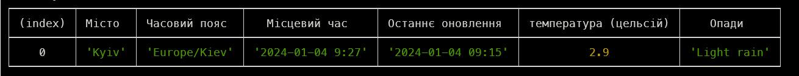
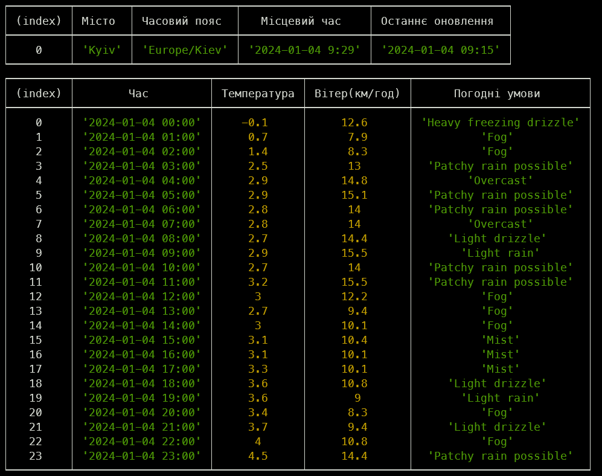

# A CLI weather

# Install

```
npm i -g @ewm235/weather-cli-ewm
```

---

# Usage

<h2><mark style="background: #CACFD9A6;">get current weather in city</mark></h2>

- `weather-cli-ewm weather -c <City_Name>`



<h2><mark style="background: #CACFD9A6;">get hourly weather forecast for the day</mark></h2>

- `weather-cli-ewm weather -c <City_Name> -a`


